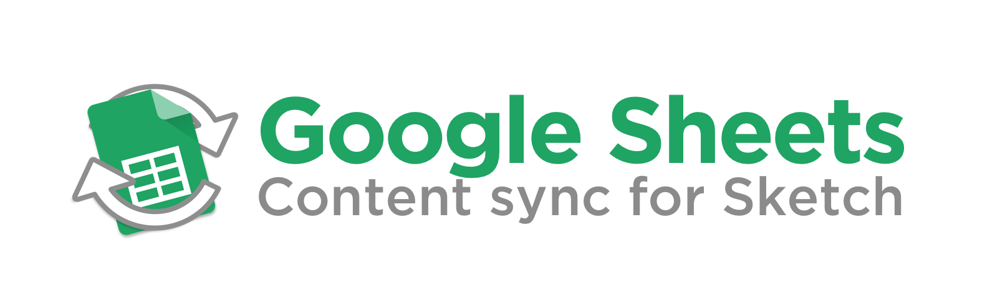

Edit and collaborate on your content in Google Sheets, then sync in back to your sketch files.

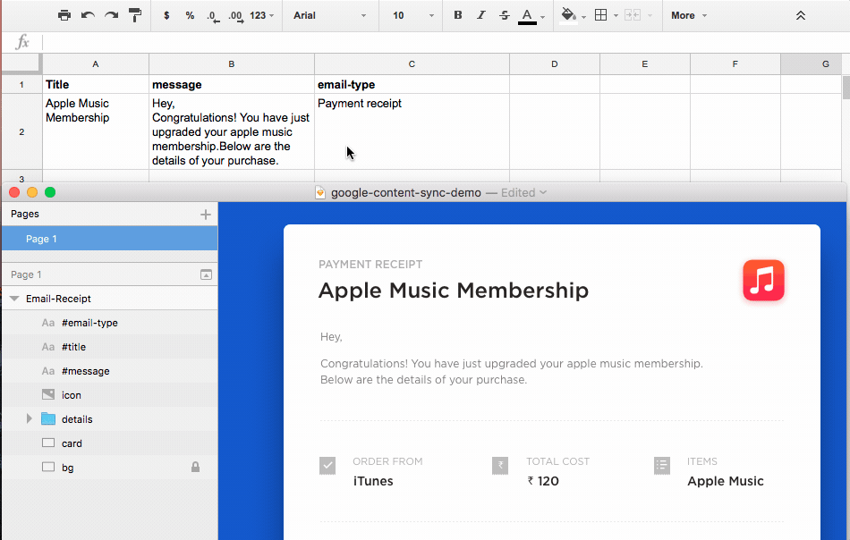

## Usage

### TL;DR
1. Create a Google Sheet — enter titles across the top, and values directly below
2. Publish it with `File > Publish to the web... > Publish`
3. Name text layers appropriately — e.g. `text layer #title`
4. Run the plugin — `control + i`

----

### 1. Create your Spreadsheet

Create a new Google Spreadsheet (unfortunately Google Docs won't work with this.)

Enter your content going horizontally, with the titles on the first line, and the values directly below. **Note: It is very important that you do it this way**

### 2. Publish the sheet

Next you need to publish the document, so that Sketch can read it's contents via the shareable link.

Do this by going `File > Publish to the web... > Publish`

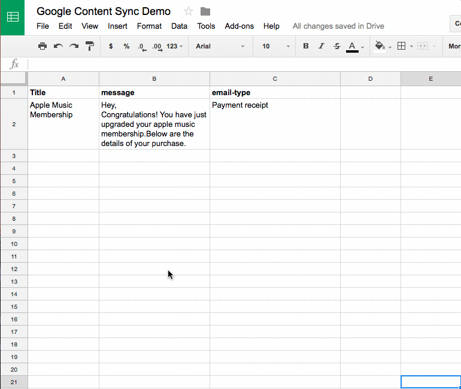

### 3. Name your layers

Now that the spreadsheet is accessible — how do you tie specific values to your layers?

**It all comes down to how you name your layers**

In the name of a layer, add a '#' followed by the title in the spreadsheet.

For example: to tie the value of 'title' to a Text Layer, give it a name like `#title`

Spreadsheet Data | Sketch Layer list
:---:|:---:
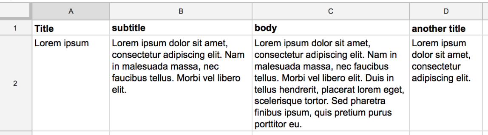 | 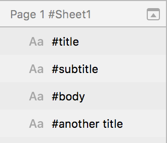

> It is not case-sensitive, and will ignore spaces — so `text #anothertitle` will still get the value for `Another Title`, you can also have other naming before the '#'. So `layer name #title` and `#title` would both work equally.

**🌄 Using images**

It is also possible to link images to shape layers. Simply tie in the image name into the name of the Shape layer, 'e.g.' `Profile pic #avatar`; then in your Google Sheet, add an image URL as the value.

**Different Sheets**

If you would like to tie the data to a specific sheet within the Google Spreadsheet, add the sheet name to your Sketch page, otherwise it will default to the first page. *(Note: Only one Google sheet, per a Sketch page)*

Spreadsheet Sheets | Sketch Page list
:---:|:---:
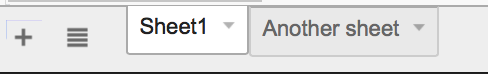 | 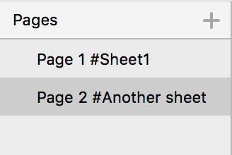

**Multiple values for the same title**

You can give multiple values to the same title, by default it will grab the first one.

To get a specific value — add the 'nth' one you want after a '.'

e.g. to get the 2nd title value a layer may be called `layer name #title.2`.

Spreadsheet Multiple values | Sketch Multiple values
:---:|:---:
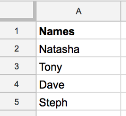 | 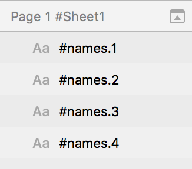

It's also possible to randomise which value is used. Instead of using a number such as `layer name #title.2` use an 'x' or 'n' — `layer name #title.n` or `layer name #title.x`.

### 4. Run the plugin

<kbd>⌃ control</kbd> + <kbd>i</kbd> to **import** the values from a spreadsheet. A popup alert will appear, allowing you to enter the URL of your Google Sheet. **Important: Use the URL of your Google Sheet in the browser address bar, DO NOT use the URL generated after clicking 'Publish to the web'.**

Then click `Import`. That's it! 🎉 The content should magically populate.

Anytime you want to re-sync the values, run the plugin again!

## Working with Symbols

**⚠️ Note: Nested symbols are not yet supported**

Symbols are great for creating an element that is used multiple times, but the content slightly differs. Which makes is a great candidate for this plugin.

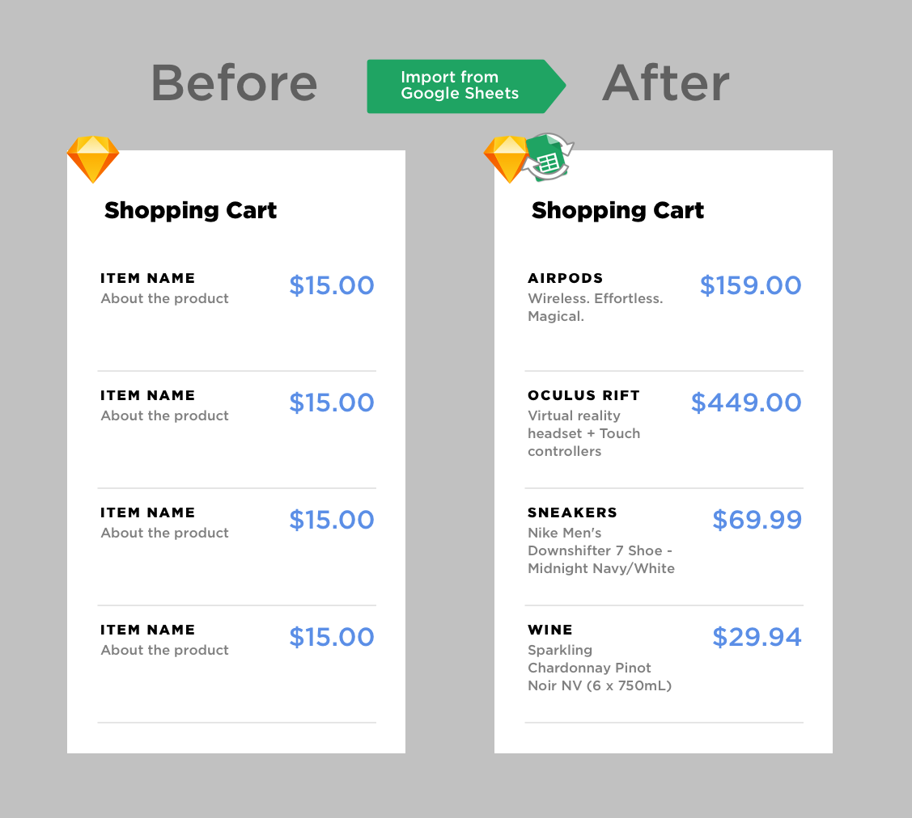

When using Symbols, make sure the layer names within the Symbol have a '#' followed by Google Sheets column title — same as explained above. So that the override label matches the column title.

Spreadsheet Columns | Sketch Symbol Layer list
:---:|:---:
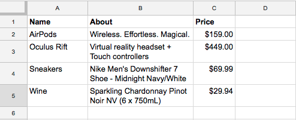 | 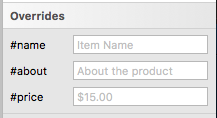

Then to make each Symbol instance refer to a different row in the spreadsheet, make sure the layer name for each Symbol instance has a '.' followed by the 'n'th row you want it to refer to. Like so...

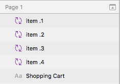

---

## Why make this plugin?

This is great for collaborating on content heavy documents, or when you may have a copywriter you work with.

There has been numerous times that I have been working on a large document with others, where we would collaborate in a Google doc. Then I would continually copy that content back into my Sketch design. This can be very frustrating after multiple iterations — when you think you're done with the content, so you copy it all into Sketch; then more updates are made, and you have to copy them all again. 😡

This plugin really saves the day in that regard — and has saved me a ton of time. 😍

Another use case, is having different versions of text across different sheets, to easily change between them.

## Installation

1. Download the plugin
2. Double-click the file, 'Google sheets content sync.sketchplugin'
3. That's it...

## Contribute

This plugin is in active development.

Pull requests are welcome and please submit bugs 🐛.

## Contact

* Email <david@williames.com>
* Follow [@davidwilliames](https://twitter.com/davidwilliames) on Twitter

---

Check out my other Sketch Plugins:
* [Nudge Resize](https://github.com/DWilliames/nudge-resize-sketch-plugin)
* [Nudge Corner Radius](https://github.com/DWilliames/nudge-corner-radius-sketch-plugin)
* [📕 PDF Export](https://github.com/DWilliames/PDF-export-sketch-plugin)

If you find this plugin helpful, consider shouting me coffee ☕️ via [PayPal](https://www.paypal.me/dtw/5)

